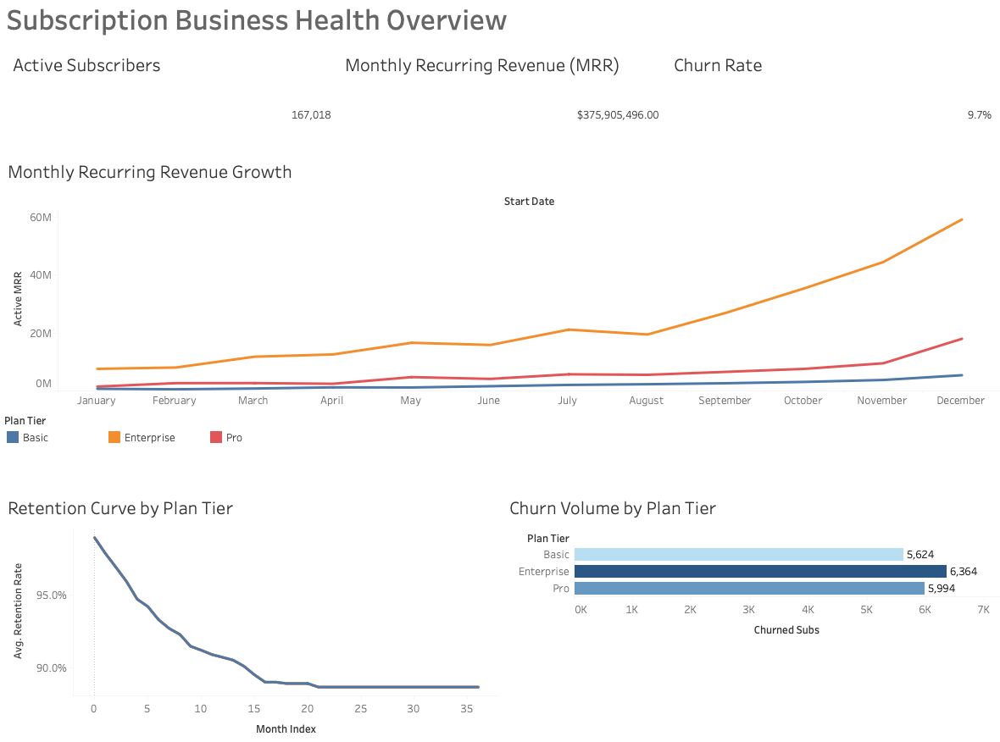
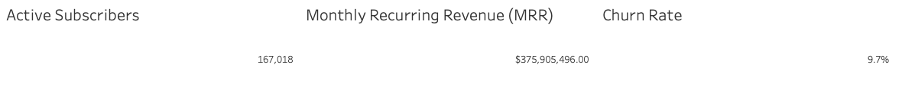
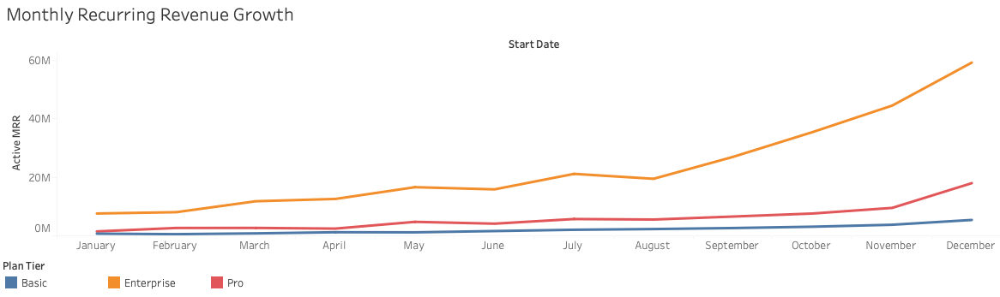
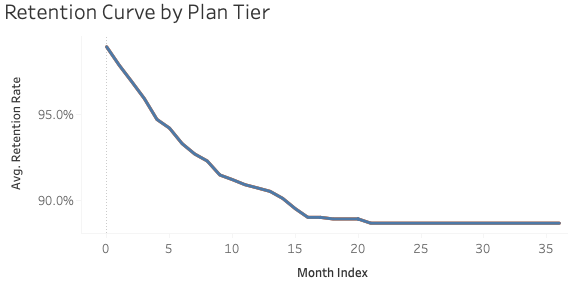
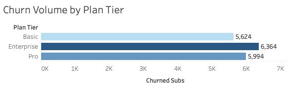
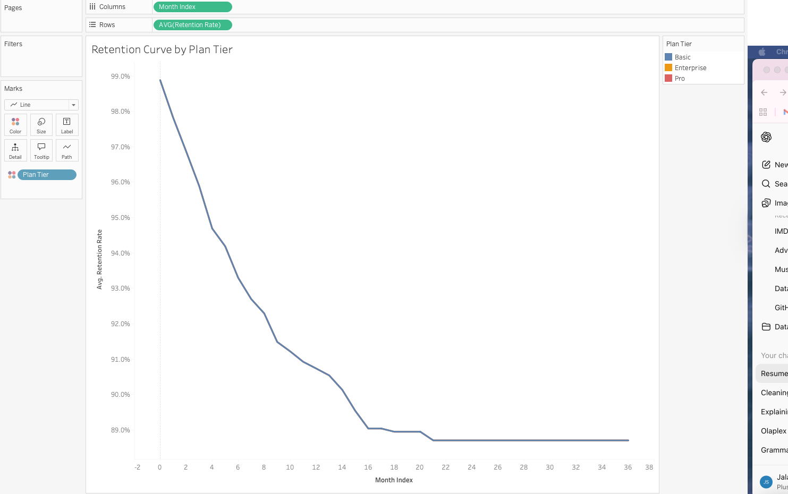

# Subscription Business Health Overview

This project presents an executive-level subscription analytics dashboard designed to evaluate revenue performance, retention behavior, and churn dynamics across subscription plan tiers.

The goal of the analysis is to move beyond surface-level metrics and provide a clear view of subscription health using cohort-based retention modeling and plan-level diagnostics. The dashboard is structured to support product, growth, and revenue decision-making in a subscription-based business.

---

## Dashboard Overview

The dashboard consolidates key subscription health indicators into a single, executive-ready view, allowing stakeholders to quickly assess performance and identify areas of risk or opportunity.

---

## Key Metrics

The KPI section highlights the core indicators used to monitor subscription health:

- Active Subscribers  
- Monthly Recurring Revenue (MRR)  
- Churn Rate  

These metrics provide a high-level snapshot of business performance and serve as entry points for deeper analysis within the dashboard.

---

## Revenue Trend Analysis

Monthly Active MRR is tracked over time and segmented by subscription plan tier. This view helps identify revenue concentration, compare growth trajectories across plans, and detect early signs of revenue stagnation or decline.

---

## Retention and Lifecycle Analysis

Retention curves are built using cohort-based modeling to show how subscriber engagement decays over time by plan tier.

A key insight from this analysis is that retention decay patterns are largely consistent across plans. This suggests that churn timing is more systemic than plan-specific, pointing toward lifecycle, onboarding, or engagement opportunities rather than pricing alone.

---

## Churn Diagnostics

Churned subscriptions are compared across plan tiers to distinguish between relative churn risk and absolute business impact. This separation helps prioritize which plans require attention based on both percentage churn and volume of lost subscriptions.

---

## Modeling and Technical Approach

Key analytical techniques used in this project include:

- Cohort-based retention modeling using a Month Index
- Time-aware subscription activity logic based on start and end dates
- Executive-focused KPI aggregation
- Plan-level segmentation to separate churn risk from churn impact
- Clear distinction between behavioral trends and revenue outcomes

The modeling approach reflects common patterns used in subscription and streaming analytics environments.

---

## Business Use Cases

This dashboard can be used to support:

- Executive subscription health reviews  
- Product and pricing strategy discussions  
- Retention and churn risk assessment  
- Revenue performance monitoring  

---

## Tools and Skills Demonstrated

- Tableau (advanced dashboarding and layout design)
- Cohort and retention analysis
- Subscription revenue modeling (MRR, churn)
- Product and lifecycle analytics
- Executive data storytelling

---

## Summary

This project demonstrates the ability to translate subscription data into decision-ready insights by combining retention modeling, revenue analysis, and clear executive reporting within a single dashboard.
